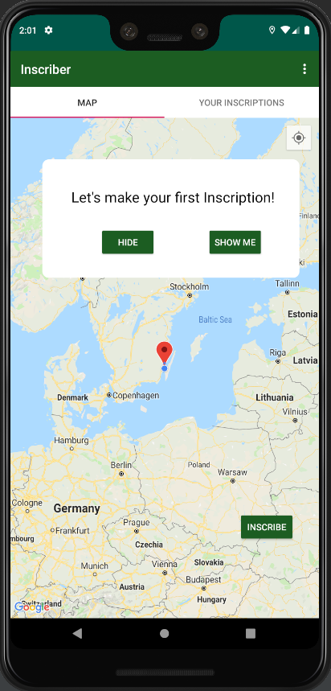
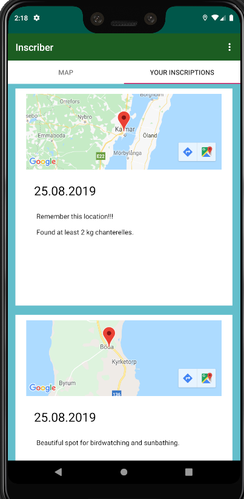
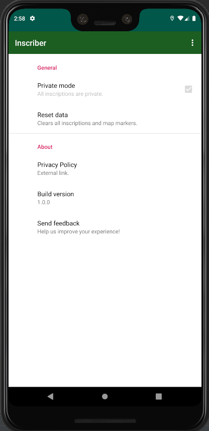

## Inscriber  

A Software Engineering project for the course 

<strong>Development of Mobile Applications (5DV209)</strong> at Umeå University. Summer 2019.

Made in Android Studio and written in Java.
#### Dependencies

Android API Level 19-28

#### Play Store description

        Venture into the wild and leave your mark.
        Leave customized messages for the next traveller.
        Get notified when near an Inscription.
 
 

<strong>Map Fragment</strong>  
 

<strong>Your Inscriptions</strong>  

<strong>Settings</strong>  
